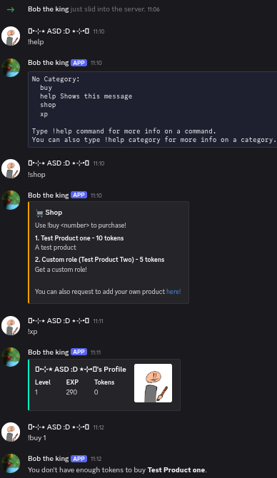

# CliffHanger Bot

The CliffHanger Discord Bot is an open-source store/leveling system bot. It allows users to level up by typing more messages, getting tokens for each level, then spending those tokens in the shop. It also allows easy customization to add more products to the shop, edit the cooldown, the XP per message, or the amount of XP needed to level up.

The default settings when you download it are set to:

Prefix: `!`

`!shop`: A command that shows all the available products, their product number, and their price!  
`!buy <#>`: A command that allows a user to buy a product by replacing `<#>` with the product number!  
`!xp`: A command that allows users to see their level, their XP, and their tokens!  
`!help`: A simple command that helps the user see what commands are available!

Cooldown: 60  
XP per message: 10  
XP required to level up: 500  
Tokens per level: 1

Since this project is open-source, the owner of the server can edit the code anytime they want and turn it into anything! And the way we set it up, the user can make the bot however they want — custom profile picture, custom name, you name it (literally)!

# How to install

This should work on all operating systems. This requires a PC, OR you can use [Termux](https://f-droid.org/packages/com.termux/) on mobile if you feel dangerous.

**Step 1:** Download the newest release [here](https://github.com/NegativeCoder01/cliffhanger-bot/releases/tag/0.1.0-rc.1) or choose from a list of releases [here](https://github.com/NegativeCoder01/cliffhanger-bot/tag/). Any version should work unless stated otherwise.

**Step 2:** Unzip the `.zip` or `.tar.gz` into any location you want.

**Step 3:** Add any products you want by editing the `products.json` file. You can copy and paste the entire field to make a new product.

**Step 4:** Customize the `bot.py` file any way you want. There are comments in there that should guide you through what each customizable thing does.

**Step 5:** Setting up the bot.

First go to the [Discord Developer Portal](https://discord.com/developers/applications) and log in.

In the top right, you should see a `New Application` button — click it.  
What the button should look like:  


Choose any name you want, select a team (optional), then make sure to agree to the [Developer ToS](https://support-dev.discord.com/hc/en-us/articles/8562894815383-Discord-Developer-Terms-of-Service) and [Developer Policy](https://support-dev.discord.com/hc/en-us/articles/8563934450327-Discord-Developer-Policy), then press Create.  


Customize however you want (optional).  


Then press the Bot button on the left to go to the bot section.  
It should look like this:  


Then look for the token and press "Reset Token".  
  
Verify it is you, and save your token somewhere where you won't lose it.

Once you have copied the token, go to the bottom of `bot.py` and replace `YOUR_BOTS_TOKEN` with your bot's actual token.  
Save the file.

After that, open your terminal and enter:

```
pip install discord.py
```

Then go into your bot's folder, right-click on `products.json` and click **Copy Path**.  
Go into `bot.py` and look for:

```python
with open("/path/to/products.json") as f:
```

Replace `/path/to/products.json` with the path you just copied.

After this, right-click the `bot.py` file and click **Copy Path**, then open terminal and enter:

```
python /the/path/you/copied/
```

Once you run that, it should say something like:

```
Logged in as ExampleBot#1234
```

If so, then it's almost ready!

**Note:** You must have this running for the bot to work. If you stop the program, it stops and has a potential loss of user data (XP, levels, tokens), so we recommend you run this on a device you can keep on constantly. We will hopefully come up with a solution in the future.

Then go back to the Bot section in the Discord Developer Portal and turn on the following:  
`Presence Intent`, `Server Members Intent`, and `Message Content Intent`.

After this, go back into the Discord Developer Portal and go to the OAuth2 section:  


Under `OAuth2 URL Generator`, click `bot` and `application.commands`.  
Set the following permissions:  
`Read Messages`, `Manage Messages`, `Use Slash Commands`, `View Channels`, `Use External Emojis`, `Embed Links`, `Read Message History`, and `Mention Everyone`.

Then set it as a guild install.  
Copy the link, open it, and add it to the server of your choosing.

After that, you are finished. Time to test!  


Thank you for choosing CliffHanger.  


<a href="https://account.venmo.com/u/MeIsNegative" target="_blank">
  <button>Want to support the creator? &#x1F5D7;</button>
</a>
